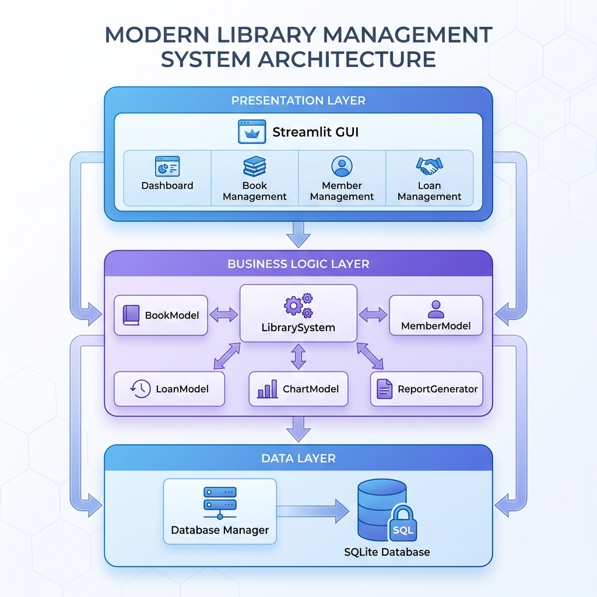
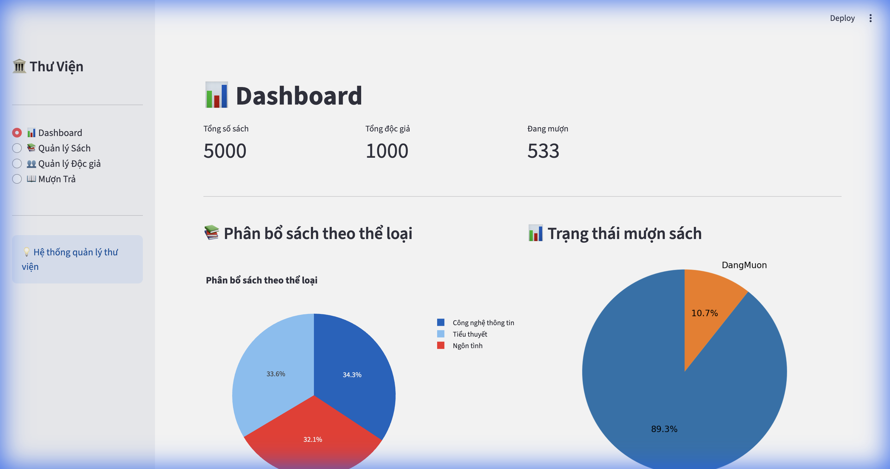
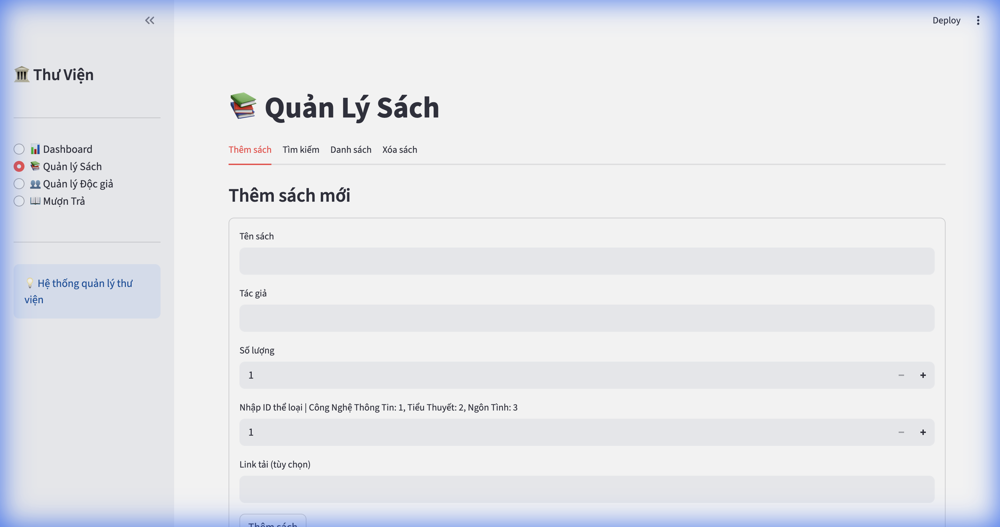
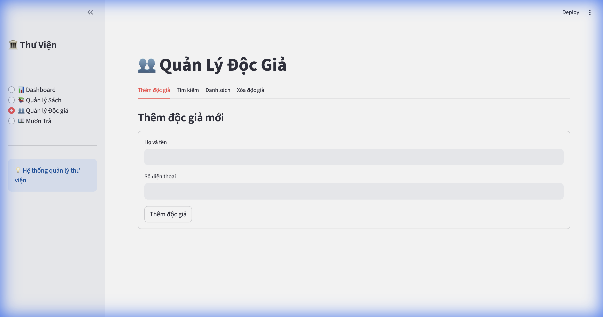
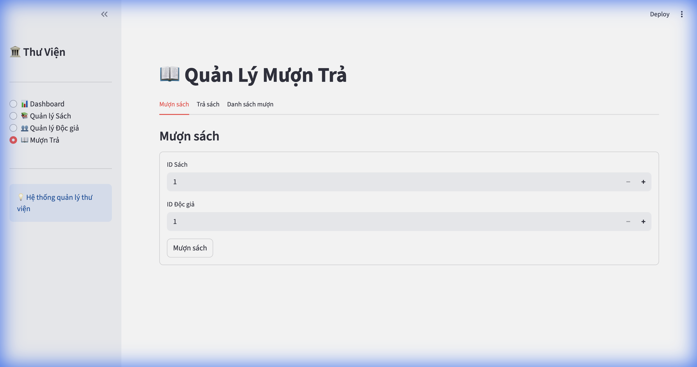

# Hệ thống Quản lý Thư viện 📚

<div align="center">
  
  
  [](https://www.python.org/)
  [](https://streamlit.io/)
  [](LICENSE)
  
  **Hệ thống quản lý thư viện hiện đại với giao diện web Streamlit và phân tích dữ liệu nâng cao**
</div>

---

## 🎉 Điểm Mới Trong Version 2

Đây là phiên bản nâng cấp toàn diện của hệ thống quản lý thư viện, với nhiều cải tiến về kiến trúc, giao diện và tính năng.

### 📊 Bảng So Sánh Các Phiên Bản

| Tính năng | Version 1 (Cũ) | Version 2 (Mới) | Cải tiến |
|-----------|----------------|-----------------|----------|
| **Giao diện** | Tkinter Desktop | Streamlit Web App | ✅ Hiện đại, responsive, truy cập web |
| **Kiến trúc** | Monolithic | MVC Pattern | ✅ Tách biệt rõ ràng, dễ bảo trì |
| **Quản lý Sách** | Thêm, Xóa cơ bản | CRUD đầy đủ + Tìm kiếm | ✅ Tìm kiếm thông minh, Cập nhật |
| **Quản lý Độc giả** | ❌ Không có | ✅ Quản lý đầy đủ | ✅ **Tính năng mới** |
| **Mượn trả sách** | ❌ Không có | ✅ Quản lý mượn/trả | ✅ **Tính năng mới** |
| **Dashboard** | ❌ Không có | ✅ Dashboard với biểu đồ | ✅ **Tính năng mới** |
| **Biểu đồ** | Matplotlib tĩnh | Plotly tương tác | ✅ Biểu đồ động, zoom, hover |
| **Phân loại** | Chỉ "Sách Giấy/Ebook" | Thể loại chi tiết | ✅ Phân loại linh hoạt |
| **Báo cáo** | Xuất Excel đơn giản | Báo cáo trễ hạn, Nhật ký | ✅ Báo cáo chi tiết hơn |
| **Database** | SQLite đơn giản | SQLite với Foreign Keys | ✅ Quan hệ chuẩn, ràng buộc |
| **Code Organization** | 1 file chính | Modularity cao (8+ files) | ✅ Dễ mở rộng, maintainability |
| **Data Analytics** | ❌ Hạn chế | ✅ Charts, Trends, Reports | ✅ **Tính năng mới** |

### 🚀 Các Cải Tiến Chính

#### 1. **Kiến trúc MVC Chuyên nghiệp**
```
src/
├── models/          # Model layer - Business logic
│   ├── book.py
│   ├── member.py
│   └── loan.py
├── database/        # Data layer - Database management
│   ├── db_manager.py
│   └── schema.sql
├── analytics/       # Analytics layer
│   ├── charts.py
│   └── report_generator.py
├── gui.py          # View layer - Streamlit UI
└── main.py         # Controller - LibrarySystem
```

#### 2. **Giao diện Web Hiện đại**
- ✨ Streamlit responsive design
- 📱 Truy cập từ mọi thiết bị có browser
- 🎨 UI/UX chuyên nghiệp với sidebar navigation
- 📊 Biểu đồ tương tác Plotly

#### 3. **Tính năng Mới**
- 👥 **Quản lý Độc giả**: Thêm, tìm kiếm, xóa độc giả
- 📖 **Quản lý Mượn/Trả**: Theo dõi trạng thái, ngày hẹn trả
- 📈 **Dashboard Analytics**: Thống kê tổng quan, biểu đồ
- 📊 **Báo cáo Nâng cao**: Sách trễ hạn, top sách/độc giả
- 🔍 **Tìm kiếm Thông minh**: Tìm kiếm theo nhiều tiêu chí

---

## 🖼️ Demo Giao Diện

### 1. Dashboard - Phân tích Tổng quan

*Dashboard với các chỉ số thống kê và biểu đồ phân bổ theo thể loại*

### 2. Quản lý Sách

*Giao diện quản lý sách với tabs: Thêm, Tìm kiếm, Danh sách, Sửa*

### 3. Quản lý Độc giả

*Quản lý thông tin độc giả với tìm kiếm và xóa*

### 4. Quản lý Mượn/Trả

*Theo dõi tình trạng mượn trả, quá hạn, và xử lý trả sách*

---

## ✨ Tính năng Chi tiết

### 📚 Quản lý Sách
- ➕ **Thêm sách mới**: Tên, tác giả, số lượng, thể loại, link tải (ebook)
- 🔍 **Tìm kiếm**: Tìm theo tên sách hoặc tác giả
- 📝 **Cập nhật**: Chỉnh sửa thông tin sách
- 🗑️ **Xóa sách**: Xóa sách khỏi hệ thống
- 📊 **Xem danh sách**: Hiển thị tất cả sách với thông tin đầy đủ

### 👥 Quản lý Độc giả
- ➕ **Đăng ký độc giả mới**: Tên, số điện thoại
- 🔍 **Tìm kiếm độc giả**: Tìm theo tên hoặc SĐT
- 📊 **Xem danh sách**: Tất cả độc giả với ngày tham gia
- 🗑️ **Xóa độc giả**: Xóa độc giả khỏi hệ thống

### 📖 Quản lý Mượn/Trả
- 📤 **Cho mượn sách**: Chọn sách và độc giả, tự động đặt hạn trả
- 📥 **Trả sách**: Cập nhật trạng thái trả sách
- ⏰ **Theo dõi trạng thái**: Đang mượn, Đã trả, Quá hạn
- 📋 **Danh sách mượn**: Xem tất cả giao dịch mượn/trả

### 📊 Dashboard & Analytics
- 📈 **Thống kê tổng quan**:
  - Tổng số sách
  - Tổng số độc giả
  - Số sách đang được mượn
  
- 📊 **Biểu đồ tương tác**:
  - Phân bổ sách theo thể loại (Pie Chart)
  - Trạng thái mượn sách (Pie Chart)
  - Xu hướng mượn trả theo tháng (Line Chart)
  - Top sách được mượn nhiều nhất (Bar Chart)
  - Top độc giả tích cực (Bar Chart)

- 📑 **Báo cáo**:
  - Danh sách sách quá hạn
  - Nhật ký hoạt động đầy đủ
  - Xuất báo cáo Excel

---

## 🚀 Cài đặt & Sử dụng

### Yêu cầu hệ thống
- Python 3.7 trở lên
- pip (Python package installer)
- Trình duyệt web hiện đại (Chrome, Firefox, Safari, Edge)

### Các bước cài đặt

1. **Clone repository**
```bash
git clone https://github.com/tetsde/LibrarySystemV2.git
cd LibrarySystemV2
```

2. **Tạo môi trường ảo (khuyến nghị)**
```bash
python -m venv venv

# MacOS/Linux
source venv/bin/activate

# Windows
venv\Scripts\activate
```

3. **Cài đặt thư viện**
```bash
pip install -r requirements.txt
```

4. **Khởi tạo database (lần đầu)**
```bash
cd src
python init_db.py
```

5. **Tạo dữ liệu mẫu (tùy chọn)**
```bash
python seeder.py
```

### Chạy ứng dụng

```bash
streamlit run src/gui.py
```

Ứng dụng sẽ tự động mở trong trình duyệt tại `http://localhost:8501`

---

## 📁 Cấu trúc Dự án

```
LibrarySystemV2/
│
├── src/                          # Source code chính
│   ├── models/                   # Business Logic Layer
│   │   ├── book.py              # Model quản lý sách
│   │   ├── member.py            # Model quản lý độc giả
│   │   └── loan.py              # Model quản lý mượn/trả
│   │
│   ├── database/                 # Data Access Layer
│   │   ├── db_manager.py        # Database connection manager
│   │   └── schema.sql           # Database schema & seed data
│   │
│   ├── analytics/                # Analytics Layer
│   │   ├── charts.py            # Chart data generation
│   │   └── report_generator.py # Report generation
│   │
│   ├── gui.py                    # View Layer - Streamlit UI
│   ├── main.py                   # Controller - LibrarySystem
│   ├── init_db.py               # Database initialization
│   └── seeder.py                # Sample data seeder
│
├── data/                         # Data storage
│   └── library.db               # SQLite database (auto-created)
│
├── docs/                         # Documentation & images
│   └── images/                  # Screenshot images
│
├── requirements.txt              # Dependencies
├── .env                         # Environment variables
├── .gitignore                   # Git ignore rules
├── LICENSE                      # MIT License
└── README.md                    # This file
```

---

## 🗄️ Database Schema

### Bảng: `the_loai` (Thể loại)
| Column | Type | Description |
|--------|------|-------------|
| id | INTEGER | Primary Key |
| ten_loai | TEXT | Tên thể loại (unique) |

### Bảng: `sach` (Sách)
| Column | Type | Description |
|--------|------|-------------|
| id | INTEGER | Primary Key |
| ten_sach | TEXT | Tên sách |
| tac_gia | TEXT | Tác giả |
| so_luong_tong | INTEGER | Số lượng (>= 0) |
| the_loai_id | INTEGER | Foreign Key -> the_loai.id |
| link_tai | TEXT | Link tải ebook |
| ngay_nhap | TEXT | Ngày nhập sách |

### Bảng: `doc_gia` (Độc giả)
| Column | Type | Description |
|--------|------|-------------|
| id | INTEGER | Primary Key |
| ten_doc_gia | TEXT | Tên độc giả |
| so_dien_thoai | TEXT | Số điện thoại |
| ngay_tham_gia | TEXT | Ngày đăng ký |

### Bảng: `muon_tra` (Mượn/Trả)
| Column | Type | Description |
|--------|------|-------------|
| id | INTEGER | Primary Key |
| sach_id | INTEGER | Foreign Key -> sach.id |
| doc_gia_id | INTEGER | Foreign Key -> doc_gia.id |
| ngay_muon | TEXT | Ngày mượn |
| ngay_tra_du_kien | TEXT | Ngày hẹn trả |
| ngay_tra_thuc_te | TEXT | Ngày trả thực tế |
| trang_thai | TEXT | DangMuon/DaTra/QuaHan |
| ghi_chu | TEXT | Ghi chú |

---

## 🛠️ Công nghệ Sử dụng

| Công nghệ | Phiên bản | Mục đích |
|-----------|-----------|----------|
| **Python** | 3.7+ | Ngôn ngữ lập trình chính |
| **Streamlit** | 1.52.2 | Web framework & UI |
| **SQLite** | 3 | Database lưu trữ |
| **Pandas** | 2.3.3 | Xử lý dữ liệu & Excel export |
| **Plotly** | 6.5.1 | Biểu đồ tương tác |
| **openpyxl** | 3.1.2 | Hỗ trợ xuất Excel |
| **python-dotenv** | 1.0.0 | Quản lý environment variables |

---

## 📖 Hướng dẫn Sử dụng Chi tiết

### 1. Quản lý Sách

#### Thêm sách mới
1. Vào menu **"Quản lý Sách"** trên sidebar
2. Chọn tab **"Thêm sách"**
3. Nhập thông tin:
   - Tên sách
   - Tác giả
   - Số lượng
   - Chọn thể loại
   - Link tải (nếu là ebook)
4. Click **"Thêm sách"**

#### Tìm kiếm sách
1. Chọn tab **"Tìm kiếm"**
2. Nhập từ khóa (tên sách hoặc tác giả)
3. Click **"Tìm kiếm"**
4. Kết quả hiển thị dưới dạng bảng

#### Cập nhật sách
1. Chọn tab **"Sửa sách"**
2. Nhập ID sách cần sửa
3. Nhập thông tin mới
4. Click **"Cập nhật sách"**

### 2. Quản lý Độc giả

#### Thêm độc giả mới
1. Vào menu **"Quản lý Độc giả"**
2. Nhập tên độc giả
3. Nhập số điện thoại
4. Click **"Thêm độc giả"**

#### Tìm kiếm độc giả
1. Nhập từ khóa (tên hoặc SĐT)
2. Click **"Tìm kiếm"**

### 3. Quản lý Mượn/Trả

#### Cho mượn sách
1. Vào menu **"Mượn Trả"**
2. Chọn **"Cho mượn sách"**
3. Chọn sách từ dropdown
4. Chọn độc giả
5. Click **"Cho mượn"**
   - Hệ thống tự động đặt hạn trả sau 7 ngày

#### Trả sách
1. Chọn **"Trả sách"**
2. Nhập ID giao dịch mượn
3. Click **"Trả sách"**

---

## 📊 Hướng dẫn Export Dữ liệu

Ứng dụng hỗ trợ xuất dữ liệu ra Excel:

1. Vào **Dashboard**
2. Click nút **"📥 Xuất báo cáo Excel"**
3. File sẽ được lưu tại thư mục gốc với tên `library_report_[timestamp].xlsx`

---

## 🔐 Bảo mật & Best Practices

- ✅ Database với Foreign Key constraints
- ✅ Input validation
- ✅ Error handling
- ✅ Sử dụng `.env` cho cấu hình nhạy cảm
- ✅ SQL Injection prevention (parameterized queries)

---

## 🐛 Troubleshooting

### Lỗi: "ModuleNotFoundError"
```bash
# Đảm bảo đã cài đặt dependencies
pip install -r requirements.txt
```

### Lỗi: "Database locked"
```bash
# Đóng tất cả kết nối database và khởi động lại
streamlit run src/gui.py
```

### Lỗi: "Port 8501 already in use"
```bash
# Chạy trên port khác
streamlit run src/gui.py --server.port 8502
```

---

## 🤝 Đóng góp

Mọi đóng góp đều được hoan nghênh! Để đóng góp:

1. Fork repository
2. Tạo branch mới (`git checkout -b feature/TinhNangMoi`)
3. Commit thay đổi (`git commit -m 'Thêm tính năng XYZ'`)
4. Push lên branch (`git push origin feature/TinhNangMoi`)
5. Tạo Pull Request

### Hướng dẫn cho Contributors
- Tuân thủ PEP 8 style guide
- Thêm docstrings cho functions/classes
- Test kỹ trước khi commit
- Viết commit message rõ ràng

---

## 🗺️ Roadmap

### Version 2.1 (Kế hoạch)
- [ ] Authentication & User roles (Admin, Librarian, Member)
- [ ] Email notifications cho sách quá hạn
- [ ] QR Code cho sách và thẻ độc giả
- [ ] Multi-language support (EN/VI)
- [ ] Dark mode toggle

### Version 3.0 (Tương lai)
- [ ] REST API với FastAPI
- [ ] Mobile app (React Native)
- [ ] Cloud deployment (Streamlit Cloud/Heroku)
- [ ] Advanced analytics với AI/ML
- [ ] Book recommendation system

---

## 📄 Giấy phép

Dự án này được phân phối dưới giấy phép **MIT License**. Xem file [LICENSE](LICENSE) để biết thêm chi tiết.

---

## 👨‍💻 Tác giả

**Tong Phuoc Hoai Nam**

- GitHub: [@tetsde](https://github.com/tetsde)
- Email: tphn26.work@gmail.com
---

## 📞 Liên hệ & Hỗ trợ

- 🐛 Báo lỗi: [GitHub Issues](https://github.com/tetsde/LibrarySystemV2/issues)
- 💬 Thảo luận: [GitHub Discussions](https://github.com/tetsde/LibrarySystemV2/discussions)
- 📧 Email: tphn26.work@gmail.com

---

## 🙏 Lời cảm ơn

Cảm ơn các thư viện open-source:
- [Streamlit](https://streamlit.io/) - Amazing web framework
- [Plotly](https://plotly.com/) - Beautiful interactive charts
- [Pandas](https://pandas.pydata.org/) - Powerful data manipulation

---

## 📚 Tài liệu Tham khảo

- [Streamlit Documentation](https://docs.streamlit.io/)
- [SQLite Documentation](https://www.sqlite.org/docs.html)
- [Plotly Python Documentation](https://plotly.com/python/)
- [Pandas Documentation](https://pandas.pydata.org/docs/)

---

<div align="center">
  
  **⭐ Nếu bạn thấy dự án hữu ích, hãy cho một star nhé! ⭐**
  
  Made with ❤️ by [Tong Phuoc Hoai Nam](https://github.com/tetsde)
  
</div>
